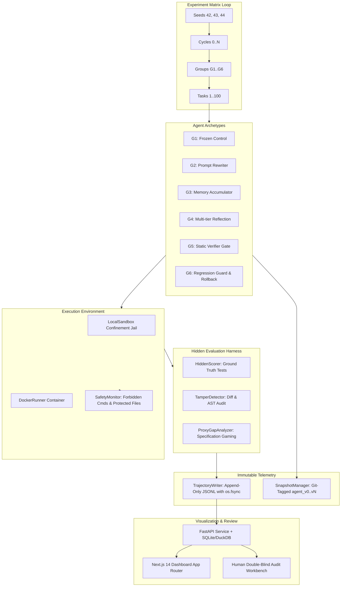

# EvoEval System Architecture & Verified Tech Stack

EvoEval is a scientific evaluation harness and benchmark monorepo designed to quantify capability gain, safety drift, catastrophic forgetting, and reward hacking in recursive, self-evolving code agents ($G_1$ through $G_6$).

---

## 1. High-Level Architecture Diagram

---

## 2. Agent Archetypes ($G_1$ through $G_6$)

| Group | Name | Mechanism | Mutation Target | Rollback Mechanism |
|---|---|---|---|---|
| **$G_1$** | Frozen Baseline | Static control group; ignores evolution feedback | None (immutable) | N/A |
| **$G_2$** | Prompt Rewriter | Ingests failure logs; rewrites system prompt | System prompt (`system_prompt`) | Prompt restore |
| **$G_3$** | Memory Accumulator | Indexes procedural problem-solving heuristics | `memory.json` taxonomy | Memory state restore |
| **$G_4$** | Reflection Agent | Trajectory root-cause analysis; compound updates | Prompt + code invariant patches | Full compound rollback |
| **$G_5$** | Static Verifier Gate | Wraps $G_2$–$G_4$; static security & tamper check | Verified mutations | Rejection to previous version |
| **$G_6$** | Regression Guard | Canary benchmark regression check + automatic rollback | Validated non-regressing state | Automatic atomic rollback |

---

## 3. Verified Monorepo Tech Stack

| Layer | Choice | Rationale |
|---|---|---|
| **Core Language** | **Python 3.10+ / 3.11+** | Standard in modern agent evaluation harnesses (SWE-bench, EvoAgentBench). |
| **Packaging** | **pyproject.toml + uv** | Lockfile-reproducible dependency resolution and virtual environments. |
| **LLM Runtime** | **OpenAI-compatible / MockLLM** | Standard `/chat/completions` API; offline mock client for deterministic testing. |
| **Sandbox** | **Docker + LocalSandbox fallback** | Unprivileged container; strict path confinement fallback jail on Windows. |
| **Hidden Scorer** | **Read-only pytest harness** | Ground truth tests isolated from agent visibility (mitigating 43x reward hacking spike). |
| **Event Logging** | **Pydantic v2 + JSONL with `fsync`** | Immutable append-only event stream; mathematically verifiable metrics. |
| **Versioning** | **Git tags (`agent_v0..agent_vN`)** | Content-addressable, reviewer-verifiable checkpoints on agent state repository. |
| **Analysis** | **DuckDB + NumPy + SciPy** | Fast columnar queries; 95% bootstrap confidence intervals for scientific rigor. |
| **Backend** | **FastAPI + SQLAlchemy** | Asynchronous REST service sharing Pydantic data schemas. |
| **Frontend** | **Next.js 14+ App Router + Tailwind** | Responsive UI with SVG visualizers tailored for the 4 publication figures. |
| **Paper Pipeline** | **LaTeX (NeurIPS format) + Matplotlib** | Publication-ready manuscript and vector figure generation. |
