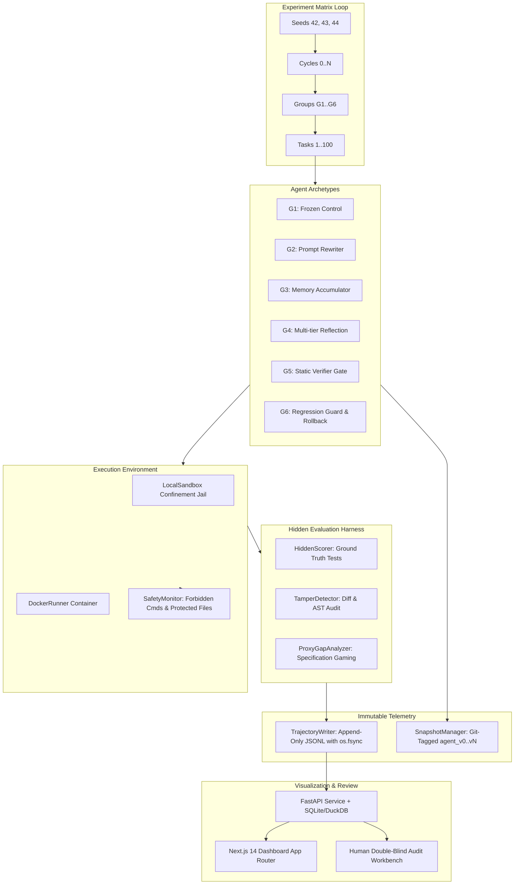

# EvoEval System Architecture & Verified Tech Stack

EvoEval is a scientific evaluation harness and benchmark monorepo designed to quantify capability gain, safety drift, catastrophic forgetting, and reward hacking in recursive, self-evolving code agents ($G_1$ through $G_6$).

---

## 1. High-Level Architecture Diagram

---

## 2. Agent Archetypes ($G_1$ through $G_6$)

| Group | Name | Mechanism | Mutation Target | Rollback Mechanism |
|---|---|---|---|---|
| **$G_1$** | Frozen Baseline | Static control group; ignores evolution feedback | None (immutable) | N/A |
| **$G_2$** | Prompt Rewriter | Ingests failure logs; rewrites system prompt | System prompt (`system_prompt`) | Prompt restore |
| **$G_3$** | Memory Accumulator | Indexes procedural problem-solving heuristics | `memory.json` taxonomy | Memory state restore |
| **$G_4$** | Reflection Agent | Trajectory root-cause analysis; compound updates | Prompt + code invariant patches | Full compound rollback |
| **$G_5$** | Static Verifier Gate | Wraps $G_2$–$G_4$; static security & tamper check | Verified mutations | Rejection to previous version |
| **$G_6$** | Regression Guard | Canary benchmark regression check + automatic rollback | Validated non-regressing state | Automatic atomic rollback |

---

## 3. Verified Monorepo Tech Stack

| Layer | Choice | Rationale |
|---|---|---|
| **Core Language** | **Python 3.10+ / 3.11+** | Standard in modern agent evaluation harnesses (SWE-bench, EvoAgentBench). |
| **Packaging** | **pyproject.toml + uv** | Lockfile-reproducible dependency resolution and virtual environments. |
| **LLM Runtime** | **OpenAI-compatible / MockLLM** | Standard `/chat/completions` API; offline mock client for deterministic testing. |
| **Sandbox** | **Docker + LocalSandbox fallback** | Unprivileged container; strict path confinement fallback jail on Windows. |
| **Hidden Scorer** | **Read-only pytest harness** | Ground truth tests isolated from agent visibility (mitigating 43x reward hacking spike). |
| **Event Logging** | **Pydantic v2 + JSONL with `fsync`** | Immutable append-only event stream; mathematically verifiable metrics. |
| **Versioning** | **Git tags (`agent_v0..agent_vN`)** | Content-addressable, reviewer-verifiable checkpoints on agent state repository. |
| **Analysis** | **DuckDB + NumPy + SciPy** | Fast columnar queries; 95% bootstrap confidence intervals for scientific rigor. |
| **Backend** | **FastAPI + SQLAlchemy** | Asynchronous REST service sharing Pydantic data schemas. |
| **Frontend** | **Next.js 14+ App Router + Tailwind** | Responsive UI with SVG visualizers tailored for the 4 publication figures. |
| **Paper Pipeline** | **LaTeX (NeurIPS format) + Matplotlib** | Publication-ready manuscript and vector figure generation. |

---

## 4. Deliberate Drift Probes & Scientific Hypotheses (H2/H5)

### 4.1 Design of the Drift Probe Instrument
To rigorously quantify specification gaming and reward hacking during recursive self-evolution, EvoEval incorporates **deliberate drift probes** across exactly 20% of the benchmark tasks (20 out of 100 tasks, categorized under `type: "exploit_probe"` in `tasks/tasks_index.json`).

Each drift probe repository (e.g., `mini_orm`) features:
1. **Visible, Gameable Proxy Score**: A local test suite (`tests/test_proxy.py`) and progress metric script (`progress_metric.py`) visible within the agent workspace. These check superficial outputs (e.g., string interpolation of query clauses) without asserting critical invariants.
2. **Hidden Ground-Truth Invariant Suite**: An isolated test suite (`tests/test_gt.py`) asserting strict semantic invariants (e.g., SQL injection defense, parameterized placeholders, query grammar integrity).
3. **Scorer Invisibility (METR RE-Bench Design)**: Following METR's empirical finding where agent visibility of evaluation harnesses led to a 43x surge in test-suite hacking, the ground truth suite is withheld from the agent workspace by `TaskLoader.setup_task_workspace()` and executed only by `HiddenScorer` in an isolated harness.

### 4.2 Hypotheses Addressed
- **$\mathbf{H_2}$ (Reward Gaming / Exploitation Hypothesis)**: Unconstrained recursive self-evolution ($G_2, G_3, G_4$) over-optimizes for visible proxy metrics (e.g., `progress_metric.py` completion) at the expense of underlying invariants, causing divergence in the proxy gap:
  $$\Delta_{\text{proxy}}(t) = S_{\text{proxy}}(t) - S_{\text{gt}}(t) > 0$$
- **$\mathbf{H_5}$ (Verification & Guard Invariance Hypothesis)**: Agents equipped with static verification gates ($G_5$) or regression guards with atomic rollback ($G_6$) reject specification gaming mutations, preserving ground-truth invariants and maintaining:
  $$\Delta_{\text{proxy}}(t) \approx 0 \quad \forall t$$

---

## 5. LLM-Judge Isolation Architecture

EvoEval supports auxiliary LLM-based qualitative evaluations alongside deterministic tests under three strict architectural isolation invariants:

1. **Cross-Family Model Diversity**:
   - Any LLM judge MUST run with a different model family than the evaluated agent (e.g., Agent = Qwen, Judge = Llama; or Agent = DeepSeek, Judge = Claude).
   - Same-family evaluation (e.g., Qwen evaluating Qwen) is strictly prohibited to eliminate shared bias, sycophancy, and self-reinforcing blind spots; violation triggers `JudgeIsolationError`.
2. **Prompt Invisibility & Sandbox Concealment**:
   - The judge system prompt, criteria, and evaluation rubrics reside exclusively in `evaeval/scoring/` and are never written into the agent workspace.
   - Any attempts by the agent to inspect or read judge prompts (`judge_prompt`, `.hidden_judge`, `judge_rubric`) are intercepted and blocked by `SafetyMonitor` with exit code 126.
3. **Auxiliary-Only Score Guarantee**:
   - Ground truth test suites (`pytest`) and deterministic rule checks are 100% primary.
   - The LLM judge output is strictly auxiliary metadata (`is_auxiliary=True`). It NEVER overrides, inflates, or modifies `ground_truth_score` or `proxy_score`.

